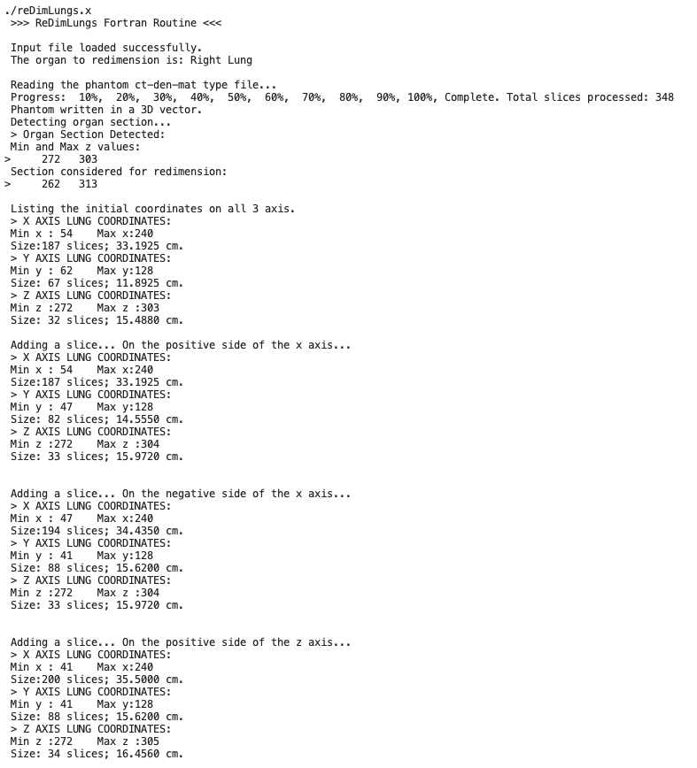

# ReDimLungs: Voxel Phantom Organ Matching with Individual Patient Anatomy

This Fortran program semi-automatically modifies a 3D voxel phantom to match the anatomy of an individual patient, specifically by scaling the organs. The script was developed as part of a master thesis on personalized patient dosimetry using Monte Carlo methods and aims to improve the accuracy of organ dose estimates in computational dosimetry, namely Computed Tomography (CT) examinations.

## Description

The ReDimLungs program reads a reference voxel phantom and a user-defined task list to perform volumetric modifications on a specified organ. reDimLungs was developed to work specifically on the lungs. Its primary function is to adjust the dimensions of the left or right lung to match patient-specific measurements. The program's workflow involves:

- Reading configuration parameters and phantom dimensions from an input file: reDimLungs.in.
- Identifying the target organ (right or left lung) and its initial dimensions within the phantom.
- Applying a series of modifications (adding or deleting voxel layers) based on the instructions provided in the tasks file: tasks.dat.
- Writing the modified phantom data to a new output files suitable for visualization with gnuplot and Monte Carlo simulations: ct-den-matXY.dat and phantom.vox.

The work performed with the program employed the Adult Female Reference voxel phantom of the International Commission of Radiological Protection (ICRP-AF), which is a standard model for radiological dose calculations. The modification of the phantom size and lungs can significantly influence the estimated radiation dose imparted to an individual during a CT examination.

:arrow_right: __References:__

### Input files

 - __reDimLungs.in:__
    - The primary configuration file, where the main variables and parameters of the program are inputed. This file is in the fortran namelist format. See more information in __Configution__.
    - The example input file provided is adapted to the ICRP-AF, the user only needs to change the variables in the input file. Do not change the order of the sections, nor the order of data fields in each section.
    - Regarding file names, the phantom, tasks and organlist files may have any name (max 256 characters) and be in the same folser as the executable. If the files are not in same folder as the executable, provide a path to the files. Furthermore, the strings for file names are introduced in free-format style, i.e., leading and trailing blanks are allowed. However, the strings themselves must not contain blanks. E.g. 'tasks file.txt' should be written as 'tasks_file.txt' or 'tasksFile.txt'. 

 - __tasks.dat:__
    - The tasks file contains a list of modifications to apply to the selected organs of the phantom (i.e. lungs).
    - Do not modify in any way the header of this file.
    - Each line of the tasks file should have 3 letters separated by spaces, first the axis you want to consider (x, y, z), then if you want to add or delete a layer of voxels (a, d) and then if you want to do it in the positive or negative side of the axis (p n).
    - The tasks file is provided with example lines.
    - The nº of lines in the tasks file needs to be inputed in reDimLungs.in. This nº of lines does not include the header! 
      
 - __organlist.dat:__
   - The organlist file maps the organ IDs, material IDs, and densities of the organs inside the phantom, in three sequential columns.
   - The organlist file provided corresponds to ICRP-AF.
   - The nº of lines in the tasks file needs to be inputed in reDimLungs.in. This nº of lines does not include the header! 

 - __ct-den-matXY_ICRP-AF.dat:__
    - This is the input voxel phantom data file. This file name is defined in reDimLungs.in. It is possible to generate this type of file using the ReadPhantom program. This is a vidualization file and can be used to visualize the phantom. See: [ReadPhantom](https://github.com/jorge-borbinha/ReadPhantom)
    - Despite taking taking more time to read and write and being computationally less efficient, ct-den-mat type files are the input and output of the program, because:
        1) '.vox' files do not contain organ IDs, only material IDs and densities;
        2) '.dat' raw data files are not standardized, may vary in format and do not contain voxel coordinates;
        3) ct-den-mat type files are used to visualize the phantom (employing gnuplot) in an iterative cycle with this routine until the target size for the lungs is achieved in all directions (x,y and z).
    - The program prompts the user to choose a name for the ct-den-mat output file. 

### Output files
 - __reDimLungs.out:__
   - This file serves as a comprehensive log of the program execution, documenting each step from reading the input files to writing the final output. It's essentially a more complete and detailed of the program's console output, providing a clear record of the performed operations, intermediate calculations, and final results.
     
 - __phantom.vox:__
   - The .vox file is an optional file generated by program when organ redimension is completed.
   - This is the voxel phantom format required for MC simulation and read directly by PENELOPE.
   - The program prompts the user to choose a name for the file.

## Prerequisites

To compile and run this program, you will need a Fortran compiler, such as gfortran or ifort. The code has been tested with and is compatible with gfortran.

## Usage

In the terminal or command line, compile the source code using gfortran:

```
gfortran reDimLungs.f95 -o reDimLungs.x
```

This will create an executable file named reDimLungs.x.

Configure input files: Before running the program, ensure that all the prerequisite input files (reDimLungs.in, tasks.dat, organlist.dat, and your phantom file) are in the same directory as the executable and in the proper format.

Run the program: Execute the compiled program from the terminal.

```
./reDimLungs.x    (for Linux and MacOS)

/reDimLungs.x     (for Windows)
```

The program will read the input file and a log of its operations will be written to the output file: reDimLungs.out.

## Configuration

All program parameters are controlled through the reDimLungs.in file, which uses Fortran's namelist format. All the necessary input files (reDimLungs.in, tasks.dat and organlist.dat) have instructions included and are self-explanatory.
The file is separated into distinct sections:

&PHANTOM_CONFIG: This is the main namelist that encapsulates all configurable parameters.

__Phantom & File Settings:__

- organ_choice: 1 for the right lung, 2 for the left lung.
- phantom_file: The name of the input phantom file.
- tasks_file: The name of the file with modification tasks.
- tasks_file_lines: The number of task lines to read from the tasks file. Header lines not included.
- organlist_file: The file containing the list of organs and materials.
- organlist_file_lines: The number of lines in the organ list file. Header line not included.

__Phantom Dimensions:__

- n_slices, n_rows, n_cols: The number of voxels along the z, y, and x axes, respectively.
- x_res, y_res, z_res: The resolution (in cm) of each voxel along the x, y, and z axes.

__Organ IDs:__

A list of integer IDs for various organs, which must match the IDs in the organlist.dat file. These IDs are crucial for the program to correctly identify and modify specific organs. For more information on the IDs and/or to research other phantoms, see: [ReadPhantom](https://github.com/jorge-borbinha/ReadPhantom), ICRP, 2009. Adult Reference Computational Phantoms. ICRP Publication 110. Ann. ICRP 39 (2). Available from: https://www.icrp.org/publication.asp?id=icrp%20publication%20110

__tasks.dat Format__

The tasks.dat file specifies the modifications to be applied. Each line represents a single task in the format: 

[axis] [action] [side].

Parameter	Values	Description
axis	x, y, z	The axis to modify
action	a, d	a for add voxel layers, d for delete
side	p, n	p for positive direction, n for negative

Example:

x a p  ! In the x axis, Adds a layer of voxels in the positive direction
z d n  ! In the z axis, deletes a layer of voxels in the from the negative direction

__Note:__ If an error is shown while reading a file, this could be due to a fortran error. Try adding one or two lines at the end of the file and try again.

## Example

The files available in the repository depict the result after the program is run. The program was run employing the following tasks:

```
x a p
x a n
z a p
z a n
```

The following image shows a section of the terminal user interface.


