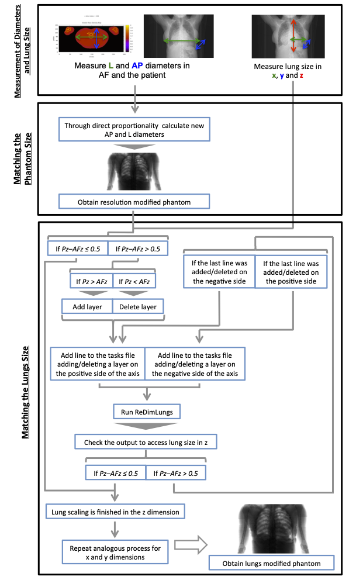

# ReDimLungs: Voxel Phantom Organ Matching with Individual Patient Anatomy

This Fortran program semi-automatically modifies a 3D voxel phantom to match the anatomy of an individual patient, specifically by scaling the organs. The script was developed as part of a master thesis and later published in a scientific article with peer review [1,2]. This work aimed towards personalized patient dosimetry using Monte Carlo methods, because improving the accuracy of the anatomical models means improving the accuracy of the organ dose estimates.

## Description

The ReDimLungs program reads a reference voxel phantom and a user-defined task list to perform volumetric modifications on a specified organ. reDimLungs was developed to work specifically on the lungs. Its primary function is to adjust the dimensions of the left or right lung to match patient-specific measurements. The program's workflow involves:

- Read configuration parameters and phantom dimensions from an input file: reDimLungs.in.
- Identify the target organ (right or left lung) and its initial dimensions within the phantom.
- Apply a series of modifications (adding or deleting voxel layers) based on the instructions provided in the tasks file: tasks.dat.
- Write the modified phantom data to new output files suitable for visualization and Monte Carlo simulations: ct-den-matXY.dat and phantom.vox.

The work performed with the program employed the Adult Female Reference voxel phantom of the International Commission of Radiological Protection (ICRP-AF), which is a reference model for radiological dose calculations. The modification of the phantom size and lungs can significantly influence the estimated radiation dose imparted to an individual during a CT examination. For more detailed information regarding the innerworkings of the reDimLungs program, consult the relevant publications [1,2].

:arrow_right: __References:__

[1] Borbinha J. Organ Dose Estimates in Thorax CT: Voxel Phantom Organ Matching With Individual Patient Anatomy. MSc Thesis, 2017. Available from: [http://hdl.handle.net/10362/](https://run.unl.pt/bitstream/10362/29982/1/Borbinha_2017.pdf) 

[2] Borbinha J, Di Maria S, Madeira P, Belchior A, Baptista M, Vaz P. Increasing organ dose accuracy through voxel phantom organ matching with individual patient anatomy. Radiat Phys Chem. 2019 Jun;159:35–46. doi: [10.1016/j.radphyschem.2019.02.014](https://www.doi.org/10.1016/j.radphyschem.2019.02.014)

The following image shows the workflow diagram of the patient/phantom matching procedure. This procedure includes matching the lateral (L) and anterior-posterior (AP) diameters of the patient/phantom and matching organ (i.e. lung) dimensions in the x, y and z directions. Note: In the diagram, AFz and Pz correspond to ICRP-AF’s and the patient’s lung dimension along the z axis, respectively.




## Input and Output Files

### Input files

 - __reDimLungs.in:__
    - The primary configuration file, where the main variables and parameters of the program are inputed. This file is in the fortran namelist format. See more information in __Configution__.
    - The example input file provided is adapted to the ICRP-AF, the user only needs to change the variables in the input file.

 - __tasks.dat:__
    - The tasks file contains a list of modifications to apply to the selected organs of the phantom (i.e. lungs).
    - The tasks file provided has 4 lines for the example rum provided with the program.
      
 - __organlist.dat:__
   - The organlist file maps the organ IDs, material IDs, and densities of the organs inside the phantom, in three sequential columns.
   - The organlist file provided corresponds to ICRP-AF.

 - __ct-den-matXY_ICRP-AF.dat:__
    - This is the input voxel phantom data file. This file name is defined in reDimLungs.in. It is possible to generate this type of file using the ReadPhantom program. This is a vidualization file and can be used to visualize the phantom. See: [ReadPhantom](https://github.com/jorge-borbinha/ReadPhantom)
    - Despite taking taking more time to read and write and being computationally less efficient, ct-den-mat type files are the input and output of the program, because:
        1) '.vox' files do not contain organ IDs, only material IDs and densities;
        2) '.dat' raw data files are not standardized, may vary in format and do not contain voxel coordinates;
        3) ct-den-mat type files are used to visualize the phantom (employing gnuplot) in an iterative cycle with this routine until the target size for the lungs is achieved in all directions (x,y and z).
    - The program prompts the user to choose a name for the ct-den-mat output file. 

### Output files
 - __reDimLungs.out:__
   - This file serves as a comprehensive log of the program execution, documenting each step from reading the input files to writing the final output. It's essentially a more complete and detailed of the program's console output, providing a clear record of the performed operations, intermediate calculations, and final results.
     
 - __phantom.vox:__
   - The .vox file is an optional file generated by program when organ redimension is completed.
   - This is the voxel phantom format required for MC simulation and read directly by PENELOPE.
   - The program prompts the user to choose a name for the file.

## Prerequisites

To compile and run this program, you will need a Fortran compiler, such as gfortran or ifort. The code has been tested with and is compatible with gfortran.

## Usage

In the terminal or command line, compile the source code using gfortran:

```
gfortran reDimLungs.f95 -o reDimLungs.x
```

This will create an executable file named reDimLungs.x.

Configure input files: Before running the program, ensure that all the prerequisite input files (reDimLungs.in, tasks.dat, organlist.dat, and your phantom file) are in the same directory as the executable and in the proper format.

Run the program: Execute the compiled program from the terminal.

```
./reDimLungs.x    (for Linux and MacOS)

/reDimLungs.x     (for Windows)
```

The program will read the input file and a log of its operations will be written to the output file: reDimLungs.out.

## Configuration

All the necessary input files (reDimLungs.in, tasks.dat and organlist.dat) have instructions included and are self-explanatory.
The file is separated into distinct sections:

&PHANTOM_CONFIG: This is the main namelist that encapsulates all configurable parameters.

__reDimLungs.in__
- All program parameters are controlled through the reDimLungs.in file, which uses Fortran's namelist format.
- Do not change the order of the sections, nor the order of data fields in each section.
- Regarding file names, the phantom, tasks and organlist files may have any name (max 256 characters) and be in the same folder as the executable. If the files are not in same folder as the executable, provide a path to the files. Furthermore, the strings for file names are introduced in free-format style, i.e., leading and trailing blanks are allowed. However, the strings themselves must not contain blanks. E.g. 'tasks file.txt' should be written as 'tasks_file.txt' or 'tasksFile.txt'. 

Phantom & File Settings:
 - organ_choice: 1 for the right lung, 2 for the left lung.
 - phantom_file: The name/path of the input phantom file.
 - tasks_file: The name/path of the file with modification tasks.
 - tasks_file_lines: The number of task lines to read from the tasks file. Header lines not included.
 - organlist_file: The name/path of the file containing the list of organs and materials.
 - organlist_file_lines: The number of lines in the organ list file. Header line not included.

Phantom Dimensions:
 - n_slices, n_rows, n_cols: The number of voxels along the z, y, and x axes, respectively.
 - x_res, y_res, z_res: The resolution (in cm) of each voxel along the x, y, and z axes.

Organ_IDs:
A list of integer IDs for various organs, which must match the IDs in the organlist.dat file. These IDs are crucial for the program to correctly identify and modify specific organs. For more information on the IDs and/or to research other phantoms, see: 
 1. [ReadPhantom](https://github.com/jorge-borbinha/ReadPhantom);
 2. ICRP, 2009. Adult Reference Computational Phantoms. ICRP Publication 110. Ann. ICRP 39 (2). Available from: https://www.icrp.org/publication.asp?id=icrp%20publication%20110

__Tasks File Format__

The tasks.dat file specifies the modifications to be applied. Do not modify in any way the header of the tasks file.
The nº of lines in the tasks file needs to be inputed in reDimLungs.in. __Attention:__ This nº of lines does not include the header! 

Each line of the tasks file should have 3 letters separated by spaces, first the axis to consider (x, y, z), then whether to add or delete a layer of voxels (a, d) and then whether to do it in the positive or negative side of the axis (p, n).

Lines are written in the following format: [axis] [action] [side].

Example:

x a p  ! In the x axis, Adds a layer of voxels in the positive direction
z d n  ! In the z axis, deletes a layer of voxels in the from the negative direction

__Organlist File Format__
The Organlist file is a simple lookup table that the program uses to understand the different parts of the human body inside the phantom. From a user's perspective, its structure is straightforward. Each line represents a single type of organ or tissue. The line is made up of three columns of numbers, which are separated by spaces (not tabs).
There's a 1 line header and 3 columns: column #1 has the organ_ID, column #2 has the Material_ID and column #3 has the Density in g/cm^3.
The user doesn't need to change this file unless they are working with a different phantom that uses a different set of organ or material IDs.
The first line in the organlist file is usually 0, which corresponds to 'air ouside phantom' - should be defined with a different Organ_ID than 'air inside phantom'.
The nº of lines in the organlist file needs to be inputed in reDimLungs.in. __Attention:__ This nº of lines does not include the header! 


__Note:__ If an error is shown while reading a file, this could be due to a fortran error. Try adding one or two lines at the end of the file and try again.


## Example

The files available in the directory "Example" depict the result after the program is run using ICRP-AF, employing the following tasks:

```
x a p
x a n
z a p
z a n
```

The following image shows a section of the terminal user interface.


## Disclaimer

This software is provided "as is" for academic, scientific, and research purposes only. It is not a medical device, nor intended for clinical use, and has not been approved by any medical regulatory authority (e.g., EMA, FDA). The authors and contributors provide this software "as is", without any warranty of any kind, either expressed or implied. This includes, but is not limited to, the implied warranties of merchantability and fitness for a particular purpose. 

The users are solely responsible for data privacy management when using this program.
- Users must ensure they have the legal and ethical authority to use and process any patient data.
- Users must de-identify and anonymize all personal health information (PHI) in accordance with all applicable data protection laws and regulations (e.g., GDPR in Europe, HIPAA in the United States) before using it with this software.
- The authors of this software take no responsibility for data breaches or misuse of personal data by users of this script.

By using this software, you acknowledge that you have read, understood, and agree to be bound by the terms of this disclaimer.


## License

Copyright (C) 2017 Jorge Cebola Borbinha, Faculty of Sciences and Technology, NOVA University of Lisbon.

The Faculty of Sciences and Technology and the NOVA University of Lisbon have the right, perpetual and without geographical boundaries, to file and publish this dissertation through printed copies reproduced on paper or on digital form, or by any other means known or that may be invented, and to disseminate through scientific repositories and admit its copying and distribution for non-commercial, educational or research purposes, as long as credit is given to the author and editor.

This program is free software: you can redistribute it and/or modify it under the terms of the MIT License.
See the MIT License for more details, available at: [MIT License](https://github.com/jorge-borbinha/Patient-specific_voxel_phantom_generation/blob/main/LICENSE.md)


